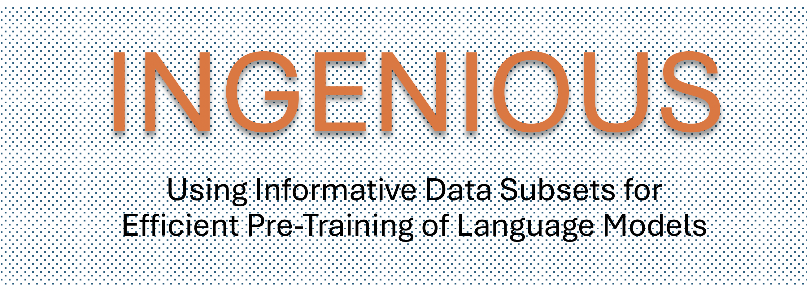
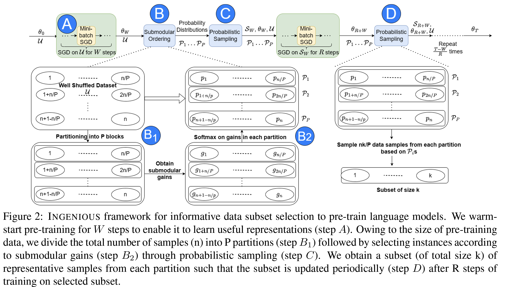

# INGENIOUS

<p align="center">
    <br>
        &nbsp&nbsp&nbsp&nbsp&nbsp&nbsp&nbsp&nbsp&nbsp&nbsp&nbsp&nbsp
        
        <!--  -->
    </br>
    <br>
        <strong> Using Informative Data Subsets for Efficient Pre-Training of Language Models </strong>
    </br>
    <br>
        (Code for reproducing results in our EMNLP 2023 Paper)
    </br>
</p>

<p align="center">
    <a href="https://github.com/Efficient-AI/ingenious/blob/main/LICENSE.txt">
        
    </a>
    <a href="#">
        
    </a>
    <a href="#">
        
    </a>
</p>

# About INGENIOUS

INGENIOUS is a framework for efficient pre-training of language models using highly informative data subsets, that is based on submodular optimization. 

# How does INGENIOUS work?

<p align="center">
    <br>
        &nbsp&nbsp&nbsp&nbsp&nbsp&nbsp&nbsp&nbsp&nbsp&nbsp&nbsp&nbsp
        
        <!--  -->
    </br>
</p>

The INGENIOUS framework (above figure) involves assigning importance scores to text samples based on submodular gains and periodically re-sampling a subset of the training data based on these scores after every few training steps. (See paper for more details)

# How to use this repository?

Change appropriate parameters in `train_mlm_nsp_ingenious.py` and run it as - `python3 train_mlm_nsp_ingenious.py`  to train the model using INGENIOUS framework.

Before running the code, please make sure you download the contents of [this google drive folder](https://drive.google.com/drive/folders/1e1hIBKAdHL4Vz4LVdjV9QI7txRlz50O5?usp=sharing)

# Dependencies

### Environment Setup
#### Run the following in a sequence to set up the environment for running the code. (It is assumed that you have anaconda installed)
>- `conda create --name ingenious python=3.9`
>- `conda activate ingenious`
>- `conda install pytorch==1.11.0 torchvision==0.12.0 torchaudio==0.11.0 cudatoolkit=11.3 -c pytorch`
>- `pip3 install -r requirements.txt`
>- `git clone https://github.com/Efficient-AI/submodlib.git`
>- `cd submodlib`
>- `pip3 install .`
>- `conda install -c conda-forge faiss-gpu`
>- `cd ..`
>- `conda deactivate`
#### Configuring the accelerate library according to the training environment
Run `accelerate config` and answer the questions that follow.
An example is given below
- In which compute environment are you running? ([0] This machine, [1] AWS (Amazon SageMaker)): **0**
- Which type of machine are you using? ([0] No distributed training, [1] multi-CPU, [2] multi-GPU, [3] TPU): **2**
- How many different machines will you use (use more than 1 for multi-node training)? [1]: **1**
- Do you want to use DeepSpeed? [yes/NO]: **NO**
- How many processes in total will you use? [1]: **8**
- Do you wish to use FP16 (mixed precision)? [yes/NO]: **NO**


# Citation

If you use *INGENIOUS* in your research, please cite our EMNLP 2023 paper :blush: -


[INGENIOUS: Using Informative Data Subsets for Efficient Pre-Training of Language Models](https://aclanthology.org/2023.findings-emnlp.445/) (Renduchintala et al., Findings 2023)


```
@inproceedings{renduchintala-etal-2023-ingenious,
    title = "{INGENIOUS}: Using Informative Data Subsets for Efficient Pre-Training of Language Models",
    author = "Renduchintala, H S V N S Kowndinya  and
      Killamsetty, Krishnateja  and
      Bhatia, Sumit  and
      Aggarwal, Milan  and
      Ramakrishnan, Ganesh  and
      Iyer, Rishabh  and
      Krishnamurthy, Balaji",
    editor = "Bouamor, Houda  and
      Pino, Juan  and
      Bali, Kalika",
    booktitle = "Findings of the Association for Computational Linguistics: EMNLP 2023",
    month = dec,
    year = "2023",
    address = "Singapore",
    publisher = "Association for Computational Linguistics",
    url = "https://aclanthology.org/2023.findings-emnlp.445/",
    doi = "10.18653/v1/2023.findings-emnlp.445",
    pages = "6690--6705",
    abstract = "A salient characteristic of pre-trained language models (PTLMs) is a remarkable improvement in their generalization capability and emergence of new capabilities with increasing model capacity and pre-training dataset size. Consequently, we are witnessing the development of enormous models pushing the state-of-the-art. It is, however, imperative to realize that this inevitably leads to prohibitively long training times, extortionate computing costs, and a detrimental environmental impact. Significant efforts are underway to make PTLM training more efficient through innovations in model architectures, training pipelines, and loss function design, with scant attention being paid to optimizing the utility of training data. The key question that we ask is whether it is possible to train PTLMs by employing only highly informative subsets of the training data while maintaining downstream performance? Building upon the recent progress in informative data subset selection, we show how we can employ submodular optimization to select highly representative subsets of the training corpora and demonstrate that the proposed framework can be applied to efficiently train multiple PTLMs (BERT, BioBERT, GPT-2) using only a fraction of data. Further, we perform a rigorous empirical evaluation to show that the resulting models achieve up to {\textasciitilde}99{\%} of the performance of the fully-trained models. We made our framework publicly available at \url{https://github.com/Efficient-AI/ingenious}."
}

```

# License

*INGENIOUS* is licensed under the MIT License. See [LICENSE](LICENSE) for more information.